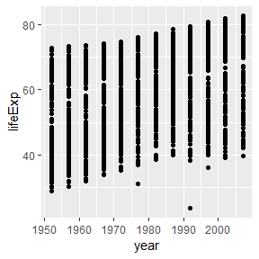

*Italic*
**Bold**

[A hyperlinke](https://google.com)

- Abulleted list
- Another list item

1. A numbered list
2. A second numbered item
    1. sub-item 1
        1. sub-sub item

* unordered list
    + sub-item
    

 
 

```
## Registered S3 methods overwritten by 'ggplot2':
##   method         from 
##   [.quosures     rlang
##   c.quosures     rlang
##   print.quosures rlang
```

```
## -- Attaching packages ---------------------------------------------------------------------------------- tidyverse 1.2.1 --
```

```
## v tibble  2.1.1     v purrr   0.3.2
## v tidyr   0.8.3     v dplyr   0.8.1
## v readr   1.3.1     v stringr 1.4.0
## v tibble  2.1.1     v forcats 0.4.0
```

```
## -- Conflicts ------------------------------------------------------------------------------------- tidyverse_conflicts() --
## x dplyr::filter() masks stats::filter()
## x dplyr::lag()    masks stats::lag()
```

```
## # A tibble: 6 x 6
##   country     continent  year lifeExp      pop gdpPercap
##   <fct>       <fct>     <int>   <dbl>    <int>     <dbl>
## 1 Afghanistan Asia       1952    28.8  8425333      779.
## 2 Afghanistan Asia       1957    30.3  9240934      821.
## 3 Afghanistan Asia       1962    32.0 10267083      853.
## 4 Afghanistan Asia       1967    34.0 11537966      836.
## 5 Afghanistan Asia       1972    36.1 13079460      740.
## 6 Afghanistan Asia       1977    38.4 14880372      786.
```
<!-- -->

<!-- -->
 

<!-- -->

<!-- -->
The lagest population of any country in this dataset is 1318683096

The maximium life expectancy in Iceland is 81.757.


<!-- Here is some more text that I am adding.  -->
<!-- Below from the github to push an existing repository from the commande line -->
<!-- git remote add origin from github -->
<!-- git push -u origin master -->
